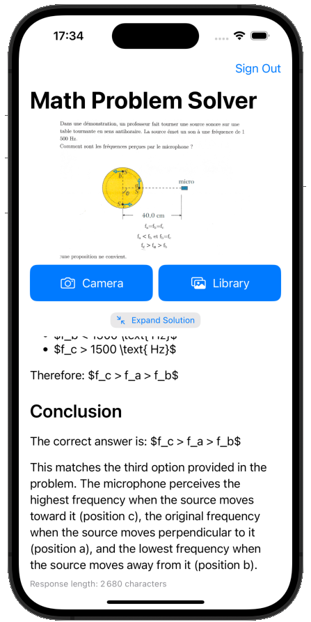

# Math Problem Solver

An iOS application that uses AWS Bedrock and Claude to solve math and physics problems from images.

## Features

- Take a photo or select an image from your photo library
- Analyze math and physics problems using Claude AI
- Get step-by-step solutions with explanations
- Secure authentication using Sign in with Apple (SIWA) and AWS STS

## Screenshot

## Technology Stack

- Swift and SwiftUI for the iOS app
- AWS Bedrock for AI image analysis and problem solving
- Claude 3 Sonnet model for high-quality responses
- Sign in with Apple (SIWA) for authentication
- AWS STS for secure token exchange
- Streaming responses for real-time feedback

## How It Works

1. The app captures or selects an image containing a math or physics problem
2. The image is processed and sent to AWS Bedrock
3. Claude analyzes the problem and generates a step-by-step solution
4. The solution is streamed back to the app in real-time
5. The app displays the formatted solution with mathematical notation

## Requirements

- iOS 16.0+
- Xcode 15.0+
- AWS account with Bedrock configured
- Sign in with Apple enabled in your Apple Developer account

## License

This project is licensed under the Apache License 2.0 - see the LICENSE file for details.
